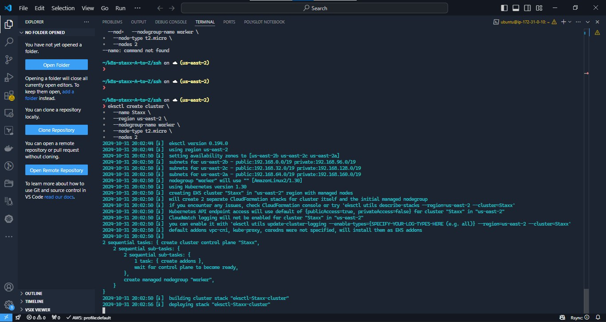

### Deploying Applications Into Kubernetes Cluster


DevOps makes software deployment cycle easier, we have applied it in
* [Migratiion of  Apps into containers](https://github.com/Johnstx/DevOps_Projects/tree/main/Project_20),
* [Efficiency in using kubernetes to run containers instead of VMs ](https://github.com/Johnstx/kubernetes-the-manual-setup.git).

Kubernetes has a lot of moving parts; it operates with several layers of abstraction between your application and host machines where it runs. 
We will deploy a software application into a kubernetes cluster using  ```YAML``` manifest files with the following k8s objects. 

1. Through this we will learn more of each of these objects - their use, configs and features.

* Pods
* ReplicaSets
* Deployments
* StatefulSets
* Services (ClusterIP, NodeIP, Loadbalancer)
* Configmaps
* Volumes
* PersistentVolumes
* PersistentVolumeClaims etc

2. Understand the difference between **stateful** and **stateless** applications

3. Limitations of using manifests directly to deploy on K8s

* Benefits of working with [Helm](https://helm.sh/) templates, its components and the most important part -semantic versioning.
* Converting all the ```.yml``` templates into a helm chart

4. Deploying more tools with Helm charts on [AWS Elastic Kubernetes Service (EKS)](https://aws.amazon.com/eks/)

* Jenkins  -MySQL -Ingress Controllers (Nginx)
* Cert-Manager
        * Ingress for Jenkins
        * Ingress for the actual application

5. Deploy monitoring Tools

* Prometheus
* Grafana

6. Hybrid CI/CD by combining different tools such as: Gitlab CICD, Jenkins. And, you will also be introduced to concepts around GitOps using Weaveworks Flux.

#### Choosing the right Kubernetes cluster set up

When it comes to using a Kubernetes cluster, there is a number of options available depending on the ultimate use of it. For example, if you just need a cluster for development or learning, you can use lightweight tools like Minikube, or k3s. These tools can run on your workstation without heavy system requirements. Obviously, there is limit to the amount of workload you can deploy there for testing purposes, but it works exactly like any other Kubernetes cluster.

On the other hand, if you need something more robust, suitable for a production workload and with more advanced capabilities such as horizontal scaling of the worker nodes, then you can consider building own Kubernetes cluster from scratch as we did earlier [here](https://github.com/Johnstx/kubernetes-the-manual-setup.git)

If you have been able to automate the entire bootstrap using Ansible, you can easily spin up your nodes with Terraform, and configure the cluster with your Ansible configuration scripts.

Other options will be to leverage a Managed Service Kubernetes cluster from public cloud providers such as: AWS EKS, Microsoft AKS, or Google Cloud Platform GKE. There are so many more options out there. Regardless of whichever one you choose, the experience is usually very similar.
Most organisations choose Managed Service options for obvious reasons such as:

Less administrative overheads
Reduced cost of ownership
Improved Security
Seamless support
Periodical updates to a stable and well-tested version
Faster cluster spin up

... and many more


###  Deploying the Tooling app using Kubernetes objects

Here we will begin to write  configurations files for kubernetes objects (they are usually referred as manifests) in the form of files with yaml syntax and deploy them using kubectl console. But first, let us understand what a Kubernetes object is.

**Kubernetes objects** are persistent entities in the Kubernetes system. Kubernetes uses these entities to represent the state of your cluster. Specifically, they can describe:

* What containerized applications are running (and on which nodes)
* The resources available to those applications
* The policies around how those applications behave, such as restart policies, upgrades, and fault-tolerance

These objects are **"record of intent"** - once you create the object, the Kubernetes system will constantly work to ensure that the object exists. By creating an object, you are effectively telling the Kubernetes system what you want your cluster's workload to look like; this is your cluster's desired state.
To work with Kubernetes objects - whether to create, modify, or delete them - you will need to use the Kubernetes API. When you use the ```kubectl``` command-line interface, for example, the CLI makes the necessary Kubernetes API calls for you. It is also possible to use ```curl``` to directly interact with the Kubernetes API, or it can be as part of developing a program in different programming languages. That will require some advance knowledge. You can [read more about client libraries](https://kubernetes.io/docs/reference/using-api/client-libraries/) to get an idea on how that works.

### Common Kubernetes objects

* Pod
* Namespace
* ResplicaSet (Manages Pods)
* DeploymentController (Manages Pods)
* StatefulSet
* DaemonSet
* Service
* ConfigMap
* Volume
* Job/Cronjob

The very first concept to understand is the difference between how **Docker** and **Kubernetes** run containers - with Docker, every ```docker run``` command will run an image (representing an application) as a container. The running container is a Docker's smallest entity, it is the most basic deployable object. Kubernetes on the other hand operates with ```pods``` instead of containers, a pod encapsulates a container. Kubernetes uses pods as its smallest, and most basic deployable object with a unique feature that allows it to run multiple containers within a single Pod. It is not the most common pattern - to have more than one container in a Pod, but there are cases when this capability comes in handy.

In the world of ```docker```, or ```docker compose```, to run the Tooling app, you must deploy separate containers for the application and the database. But in the world of Kubernetes, you can run both: application and database containers in the same Pod. When multiple containers run within the same Pod, they can directly communicate with each other as if they were running on the same ```localhost```. Although running both the application and database in the same Pod is **NOT** a recommended approach.

A Pod that contains one container is called ```single container pod``` and it is the most common Kubernetes use case. A Pod that contains multiple co-related containers is called ```multi-container pod.``` There are few patterns for multi-container Pods; one of them is the **[sidecar](https://medium.com/bb-tutorials-and-thoughts/kubernetes-learn-sidecar-container-pattern-6d8c21f873d)** container pattern - it means that in the same Pod there is a main container and an auxiliary one that extends and enhances the functionality of the main one without changing it.
There are other patterns, such as: [init container](https://medium.com/bb-tutorials-and-thoughts/kubernetes-learn-init-container-pattern-7a757742de6b), [adapter container](https://medium.com/bb-tutorials-and-thoughts/kubernetes-learn-adaptor-container-pattern-97674285983c), [ambassador container](https://medium.com/bb-tutorials-and-thoughts/kubernetes-learn-ambassador-container-pattern-bc2e1331bd3a).

In kubernetes objects, you will find separated heading in the YAML manifests used in creating them. E.g

* **kind**: This specifes the type of kubernetes object that owns the manifest file. E.g Prd, DaemonSet, Deployments, Service etc.
* **version**: Specifies the kuberntes api version used to creare the resource. E.g v1, v1beta or v2.
* **metadata**: This provides information about the resource, like name of the Pod, the ```namespace``` which the pod will run in, ```labels``` and ```annotations```
* **spec**:  consists of the core information about Pod. Here we will tell kubernetes what would be the expected state of resource, Like container image, number of replicas, environment variables and volumes.
* **status**: consists of information about the running object, status of each container. Status field is supplied and updated by Kubernetes after creation. This is not something you will have to put in the YAML manifest.

Lets deploy some k8s objects and observe their manifest files.

#### Deploying a random Pod
Lets deploy a pod in  a cluster.

We will use EKS - Elastic Kubernetes Service from AWS for this job.
I use a window and had ```WSL`` installed previouly. Install [WSL](https://learn.microsoft.com/en-us/windows/wsl/install) here.

Reboot, then go to Microsoft Store, search for your preferred Linux distribution (e.g., **Ubuntu**), and install it.

Set up the WSL so you can interact AWS resources including Kubernetes (EKS).
* Install the eks client - 

```
$ curl --silent --location "https://github.com/weaveworks/eksctl/releases/latest/download/eksctl_$(uname -s)_amd64.tar.gz" | tar xz -C /tmp
```

Move to /usr/local/bin

```
$ sudo mv /tmp/eksctl /usr/local/bin
```

```
$ eksctl version
```
Install awscli

 ```sudo apt install awscli```

setup your aws IAM profile and update - 

```aws configure```

Install pip

```sudo apt install python3-pip```

Upgrade the awscli

```pip install --upgrade awscli```

Setup **kubectl**

```
curl -LO "https://dl.k8s.io/release/$(curl -L -s https://dl.k8s.io/release/stable.txt)/bin/linux/amd64/kubectl"
``` 

Download the kubectl checksum file

```
curl -LO "https://dl.k8s.io/release/$(curl -L -s https://dl.k8s.io/release/stable.txt)/bin/linux/amd64/kubectl.sha256"
```

Download the kubectl checksum file


```
echo "$(cat kubectl.sha256)  kubectl" | sha256sum --check
```

Install kubectl

```
sudo install -o root -g root -m 0755 kubectl /usr/local/bin/kubectl
``` 

Verify

```
kubectl version --client
```

```kubectl``` will be used to interact with the cluster. With this tool, you can perform actions on the cluster remotely.

**Depoly  a Cluster**
*We have eksctl and kubectl ready, we can then create a cluster*

```
eksctl create cluster \
    --name Staxx \
    --region us-east-2 \
    --nodegroup-name worker \
    -- node 2
``` 


**UPDATE THE kubeconfig file**
Update the kubeconfig file with details of the cluster createed, this will enable interactions with ```kubectl`` commands.

```
aws eks update-kubeconfig --name staxx-tooling-app --region us-west-2
```


Run a kubectl command to verify successful update.
E.g

``` 
kubectl get nodes
```


**Deploying an application - NGINX  in the cluster**

*The following approach used here is just for a demo purpose, more advanced and reliable ways should be used to deploy pods in a real setup*

**Create a Pod for the NGINX App**

Use the manifest file below to create a pod - 
Save in a file named ```nginx-pod.yml``` 

```
apiVersion: v1
kind: Pod
metadata:
  name: nginx-pod
  labels: 
    app: nginx-pod
spec:
  containers:
  - image: nginx:latest
    name: nginx-pod
    ports:
    - containerPort: 80
      protocol: TCP
```

Create the pods

``` 
kubectl apply -f nginx-pod.yml
``` 
To access the pods, you can use the ```kubectl get pods``` or ``` kubectl describe pods``` commands


### Accessing the app from the browser

The ultimate goal of any solution is to access it either through a web portal or some application (e.g., mobile app). We have a Pod with Nginx container, so we need to access it from the browser. But all you have is a running Pod that has its own IP address which cannot be accessed through the browser. To achieve this, we need another Kubernetes object called **[Service](https://kubernetes.io/docs/concepts/services-networking/service/)** to accept our request and pass it on to the Pod.

A service is an object that accepts requests on behalf of the Pods and forwards it to the Pod's IP address. You will find the pod's IP address when you run the command below - 

``` 
kubectl get pod nginx-pod  -o wide 
``` 


Let try and access the pod through its IP adresss from within the cluster. For this,
1. We need an image that already has ```curl``` software installed. You can check it [here](https://hub.docker.com/r/dareyregistry/curl)

```
dareyregistry/curl
```

2. Run ```kubectl``` to connect inside the container.

```
kubectl run curl --image=dareyregistry/curl -i --tty
``` 

3. Run ```curl``` and point to the IP address of the Nginx Pod (Use the IP address of your own Pod)

```
# curl -v 192.168.8.98:80
```
*Observe the status response from the API*


The above setup is suitable for internal use ONLY, with no internet requirement  but if your have an application who want to receive out-of-cluster traffic / over the internet traffic, the above idea will not work, you need to configure appriopriately. 

Assuming that your requirement is to access the Nginx Pod internally, using the Pod's IP address directly as above is not a reliable choice because Pods are ephemeral. They are not designed to run forever. When they die and another Pod is brought back up, the IP address will change and any application that is using the previous IP address directly will break.
To solve this problem, kubernetes uses **Service** - An object that abstracts the underlining IP addresses of Pods. A service can serve as a load balancer, and a reverse proxy which basically takes the request using a human readable **DNS** name, resolves to a Pod IP that is running and forwards the request to it. This way, you do not need to use an IP address. Rather, you can simply refer to the service name directly.

**Deploying a service to access the NGINX Pod**

1. Create a Service ```yaml``` manifest file:

```
sudo cat <<EOF | sudo tee ./nginx-service.yaml
apiVersion: v1
kind: Service
metadata:
  name: nginx-service
spec:
  selector:
    app: nginx-pod 
  ports:
    - protocol: TCP
      port: 80
      targetPort: 80
EOF
```

*Note the section of the manifest that specifies the pod which the service targets*

``` spec:
  selector:
    app: nginx-pod 
```

2. Create a ```nginx-service``` resource by applying your manifest
```
kubectl apply -f nginx-service.yaml
```

3. Check the created service

```
kubectl get service
```


Run 
 ``` kubectl describe svc nginx-service ``` 


A ```clusterIP``` type of service is created by default since no other type was specified during creation of the service.

Other types of service are -
* NodePort
* LoadBalancer
* Headless Service

To access the app over the service created, we use the port-forwarding functionality.

```
kubectl  port-forward svc/nginx-service 8089:80
``` 


**8089** is an arbitrary port number on yourPC, and we want to tunnel traffic through it to the port number of the nginx-service 80.


On the web browser, enter ```localhost:8089``` to see the nginx page in the browser.


#### Expose a Service on a server's public IP address & static port
We have accessed a server/node (our nginx) on a clusterIP, a private IP through port-forwarding. Lets try same through the public IP. To achive this, we have to use a different kind of serivce, the **[nodePort](https://kubernetes.io/docs/concepts/services-networking/service/#nodeport)**

A **Node port** service type exposes the service on a static port on the node's IP address. NodePorts are in the 30000-32767 range by default, which means a NodePort is unlikely to match a service’s intended port (for example, 80 may be exposed as 30080).

Lets  update the nginx-service yaml to use a NodePort service.

```
apiVersion: v1
kind: Service
metadata:
  name: nginx-service
spec:
  type: NodePort
  selector:
    app: nginx-pod
  ports:
    - protocol: TCP
      port: 80
      nodePort: 30080
```

*We have specfied the type of service (NodePort) and the NodePort number to use*

Next, Lets look at ReplicaSet and see what it looks like.

To delete the nginx-pod:
``` kubectl delete -f nginx-pod.yml```


#### Create a ReplicaSet
Lets create a ReplicaSet object from a file ```rs.yml```
```
#Part 1
apiVersion: apps/v1
kind: ReplicaSet
metadata:
  name: nginx-rs
spec:
  replicas: 3
  selector:
    app: nginx-pod
#Part 2
  template:
    metadata:
      name: nginx-pod
      labels:
         app: nginx-pod
    spec:
      containers:
      - image: nginx:latest
        name: nginx-pod
        ports:
        - containerPort: 80
          protocol: TCP

```

```
kubectl apply -f rs.yaml
``` 

Check the pods created

```
kubectl get pods
```


#### Using AWS LoadBalancer to access your service in Kubernetes.
Lets explore the use of the LoadBalancer type of service.

Update the service manifest with the file below

```
apiVersion: v1
kind: Service
metadata:
  name: nginx-service
spec:
  type: LoadBalancer
  selector:
    tier: frontend
  ports:
    - protocol: TCP
      port: 80 # This is the port the Loadbalancer is listening at
      targetPort: 80 # This is the port the container is listening at
```

```
kubectl apply -f nginx-service.yaml
```
Get the newly created service 

```
kubectl get service nginx-service
```
*An ALB will be created on the AWS console*


A Kubernetes component in the control plane called **Cloud-controller-manager** is responsible for triggeriong this action. It connects to your specific cloud provider's (AWS) APIs and create resources such as Load balancers. It will ensure that the resource is appropriately tagged.

1. A clusterIP key is updated in the manifest and assigned an IP address. Even though you have specified a Loadbalancer service type, internally it still requires a clusterIP to route the external traffic through.
2. In the ports section, ```nodePort``` is still used. This is because Kubernetes still needs to use a dedicated port on the worker node to route the traffic through. 
3. Ensure that port range ```30000-32767``` is opened in your inbound Security Group configuration.
More information about the provisioned balancer is also published in the ```.status.loadBalancer``` field.


Note the hostname on last row, paste this hostname on the browser to access the application, NGINX.

To view details of the service, you can run the ```get``` or ```describe``` command.
``` kubectl get svc nginx-service``` OR ```kubectl describe nginx-service```


#### Deployments
*Officially, it is highly recommended to use Deplyments to manage replica sets rather than using replica sets directly*

A Deployment is another layer above ReplicaSets and Pods, newer and more advanced level concept than ReplicaSets. It manages the deployment of ReplicaSets and allows for easy updating of a ReplicaSet as well as the ability to roll back to a previous version of deployment. It is declarative and can be used for rolling updates of micro-services, ensuring there is no downtime.

1. Lets delete the ReplicaSet

``` kubectl delete rs nginx-rs``` 

2. Understand the layout of the deployment.yaml manifest below. Lets go through the 3 separated sections:

``` 
# Section 1 - This is the part that defines the deployment
apiVersion: apps/v1
kind: Deployment
metadata:
  name: nginx-deployment
  labels:
    tier: frontend

# Section 2 - This is the Replica set layer controlled by the deployment
spec:
  replicas: 3
  selector:
    matchLabels:
      tier: frontend

# Section 3 - This is the Pod section controlled by the deployment and selected by the replica set in section 2.
  template:
    metadata:
      labels:
        tier: frontend
    spec:
      containers:
      - name: nginx
        image: nginx:latest
        ports:
        - containerPort: 80
``` 
3. Putting them altogether

```
apiVersion: apps/v1
kind: Deployment
metadata:
  name: nginx-deployment
  labels:
    tier: frontend
spec:
  replicas: 3
  selector:
    matchLabels:
      tier: frontend
  template:
    metadata:
      labels:
        tier: frontend
    spec:
      containers:
      - name: nginx
        image: nginx:latest
        ports:
        - containerPort: 80
``` 


```
kubectl apply -f deployment.yaml
```
The deployment object is the most top layer resource when pods are deployed. Under the deployment layer, there is the ReplicaSet, then the pods. Since creating a Deployment object also creates a ReplicaSet a layer below, we can run commands to get details on the ReplicaSet.

Get the deployment

```kubectl get deploy```

Get the replicaset

```kubectl get rs```

Get the pods

```kubectl get pods```

Exec into one of the Pod's container to run Linux commands

```
kubectl exec -it nginx-deployment-56466d4948-78j9c bash
``` 


List the files and folders in the Nginx directory
should have  a structure similar to below 
```
root@nginx-deployment-56466d4948-78j9c:/# ls -ltr /etc/nginx/
total 24
-rw-r--r-- 1 root root  664 May 25 12:28 uwsgi_params
-rw-r--r-- 1 root root  636 May 25 12:28 scgi_params
-rw-r--r-- 1 root root 5290 May 25 12:28 mime.types
-rw-r--r-- 1 root root 1007 May 25 12:28 fastcgi_params
-rw-r--r-- 1 root root  648 May 25 13:01 nginx.conf
lrwxrwxrwx 1 root root   22 May 25 13:01 modules -> /usr/lib/nginx/modules
drwxr-xr-x 1 root root   26 Jun 18 22:08 conf.d
```

Check the content of the default Nginx configuration file

```
root@nginx-deployment-56466d4948-78j9c:/# cat  /etc/nginx/conf.d/default.conf 
server {
    listen       80;
    listen  [::]:80;
    server_name  localhost;

    #access_log  /var/log/nginx/host.access.log  main;

    location / {
        root   /usr/share/nginx/html;
        index  index.html index.htm;
    }

    #error_page  404              /404.html;

    # redirect server error pages to the static page /50x.html
    #
    error_page   500 502 503 504  /50x.html;
    location = /50x.html {
        root   /usr/share/nginx/html;
    }

    # proxy the PHP scripts to Apache listening on 127.0.0.1:80
    #
    #location ~ \.php$ {
    #    proxy_pass   http://127.0.0.1;
    #}

    # pass the PHP scripts to FastCGI server listening on 127.0.0.1:9000
    #
    #location ~ \.php$ {
    #    root           html;
    #    fastcgi_pass   127.0.0.1:9000;
    #    fastcgi_index  index.php;
    #    fastcgi_param  SCRIPT_FILENAME  /scripts$fastcgi_script_name;
    #    include        fastcgi_params;
    #}

    # deny access to .htaccess files, if Apache's document root
    # concurs with nginx's one
    #
    #location ~ /\.ht {
    #    deny  all;
    #}
}
```


#### Persisting Data for Pods

Deployments are stateless by design. Hence, any data stored inside the Pod's container does not persist when the Pod dies.

If you were to update the content of the ```index.html``` file inside the container, and the Pod dies, that content will be lost since a new Pod will replace the dead one.
To see this,
1. Scale the Pods down to 1 replica.

2. Exec into the running container 
3. Install ``vim`` so that you can edit the file

```
apt-get update
apt-get install vim
```
